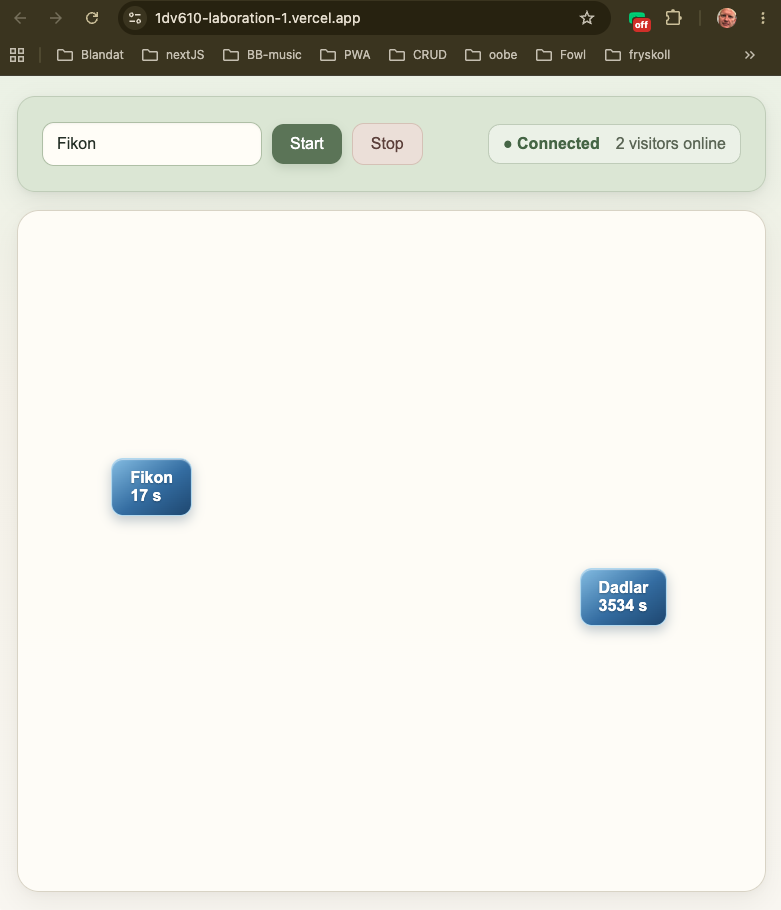

# Reflektion: Laboration 1 – Fortsätt programmera

## 1. Att fortsätta programmera

*Vilka kunskaper och färdigheter från tidigare kurser bygger du vidare på i den här uppgiften? Vad var mest utmanande? Vad vill du utveckla vidare i din programmering framöver?*

Måndag 7 september 13:15 Svar: Jag lärde mig **JavaScript förra året** och tycker därför att det är ett naturligt nästa steg att försöka programmera så mycket som möjligt i **TypeScript**. Jag kan bygga vidare på det jag redan kan samtidigt som jag lär mig att arbeta med **typer, tydligare struktur och bättre felkontroll**. TypeScript känns också särskilt relevant eftersom vi nu ska arbeta mer med **objektorienterad programmering**, och jag vill bli van vid att använda det som mitt huvudsakliga programmeringsspråk när det passar.

Tisdag 8 september 19:45 Svar: Det mest utmanande var egentligen inte själva programmeringen utan att förstå hur alla delar runt programmet hänger ihop: **Vite → TypeScript → Convex → development/production → Vercel → två datorer → samma databas i realtid.** Det blev en del trixande med **environment variables och `.env`-filer**, och framför allt med att förstå vilken Convex-databas som användes i development respektive production och hur databasen kopplades ihop med resten av applikationen. I början var det lite svårt att få en tydlig bild av hur frontend, databasen och den publicerade sidan kommunicerade med varandra. När jag till slut kunde öppna den publicerade sidan på två olika datorer och se att det jag gjorde på den ena datorn direkt syntes på den andra blev det mycket tydligare hur alla delarna hänger ihop och hur en realtidsapplikation faktiskt fungerar.

## 2. Arbetsflödet

*Hur kändes det att arbeta med Git och använda kursens plattformar?*

Tisdag 8 september 19:45 Svar: Jag har arbetat med Git tidigare. Det har känts bra och Git-historiken har blivit en loggbok över hur programmet har vuxit fram. Det som var lite förvirrande i början var att hålla isär **GitHub, kursens GitLab och de olika remotes som finns i mitt lokala repository**. När jag väl förstod att samma lokala projekt kan pushas till både GitHub och LNU:s GitLab blev arbetsflödet mycket tydligare.

*Varför valde du GitLab eller GitHub för din kod? Vad vägde du in — till exempel integritet, att bygga en publik portfolio, eller vana? Om GitHub — länk till ditt repo:*

Tisdag 8 september 19:45 Svar: Jag valde **GitHub** som den plats där jag arbetar med och kontinuerligt pushar min kod. Samtidigt använder jag **LNU:s GitLab för själva inlämningen**. Mitt GitHub-repository är:

[github.com/niklasgolf/1dv610-laboration-1](https://github.com/niklasgolf/1dv610-laboration-1)

## 3. Bedömning och att dela publikt

*Uppgiften bedöms inte på kodens stil eller kvalitet, bara på en komplett inlämning. Påverkade det hur du arbetade? Och hur kändes det att posta din skärmdump/video publikt i Zulip, utan möjlighet att göra det privat?*

Tisdag 8 september 21:00 Svar: Jag tror egentligen inte att det påverkade mig så mycket att kodens stil och kvalitet inte bedöms. Jag ville ändå göra något som jag tyckte var roligt och där jag kunde lära mig nya saker med TypeScript, Convex, realtidsuppdateringar och publicering på Vercel. Jag lade också ganska mycket tid på att förstå hur allt fungerade. Att lägga upp resultatet publikt i Zulip kändes bra. I mitt fall blev det extra kul eftersom jag kunde länka till den publicerade appen, så att de andra studenterna faktiskt kan testa den. Om flera går in samtidigt kan de dessutom se varandra i realtid, vilket visar en viktig del av det jag har byggt.

## 4. Ditt program

*Vilket programmeringsspråk valde du, och varför just det?*

Måndag 7 september 13:15 Svar: Jag valde **TypeScript** eftersom jag tycker att det ger mig det bästa av både JavaScript och Java: **flexibiliteten och webbnärheten från JavaScript**, tillsammans med **typer, tydligare struktur och bra stöd för objektorienterad programmering** som jag uppskattar från Java.

*Vad gjorde du för att göra välkomstmeddelandet till något mer än bara* `"Hej " + namn`*?*

Tisdag 8 september 19:45 Svar: Jag gjorde välkomstmeddelandet till en liten **realtidsapplikation** istället för att bara visa `"Hej " + namn`. När en person skriver sitt namn och trycker på **Start** skapas en besökare i en **Convex-databas** och visas som en liten ruta på sidan med sitt namn och hur många sekunder personen har varit där. Besökarna får slumpmässiga positioner och antalet personer online visas högst upp. Eftersom Convex uppdaterar sidan i realtid kan jag öppna den publicerade sidan på **två olika datorer** och direkt se på båda när en ny person ansluter eller trycker på **Stop** och försvinner.

**Testa appen:** [https://1dv610-laboration-1.vercel.app/](https://1dv610-laboration-1.vercel.app/)

## 5. AI-samarbete

*Samarbetade du med någon AI-assistent (t.ex. ChatGPT, GitHub Copilot, Claude) — som en kollega snarare än bara ett verktyg? Beskriv kort hur, och ge gärna ett exempel på en prompt som gav ett bra resultat.*

Måndag 7 september 13:15 Svar: Jag har använt **ChatGPT (GPT-5.6 Sol)**. Det fungerar bra att börja med en enkel fråga och sedan skicka skärmbilder för att få hjälp steg för steg, till exempel när jag konfigurerade **eduVPN och eduroam**. I år kommer jag också att använda **Cursor istället för VS Code**. Jag tror att Cursor lättare kan förklara koden eftersom AI:n har direkt tillgång till kontexten i projektet och jag slipper kopiera in kod hela tiden.

Tisdag 8 september 8:35 Svar: Jag skrev lite kod, och ville vara säker på att jag hade gjort rätt så jag skrev denna prompt: Explain the file @convex/schema.ts to me as a beginner learning TypeScript and Convex. Go through the code line by line and explain: - what each import means - what defineSchema does - what defineTable does - what v means - what v.string() and v.number() mean - what "visitors" represents - what name, startTime, x and y represent - what export default means - how this schema will relate to the Convex database. Important: Do not edit, create, delete, or modify any files. Do not write code for me. Only explain the code that already exists.

Jag fick tillbaka ett par sidor text med väldigt tydliga förklaringar av typ varje rad. Det var typ som jag tänkt men bra att få det en gång till med bättre och tydligare förklaringar. Jag använder chatGPT ovanpå detta med nån screenshot om jag inte förstår.

## 6. Bild eller video

*Bifoga (eller länka till) samma skärmdump/video som du postat i Zulip.*

Svar:

